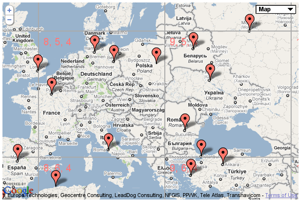
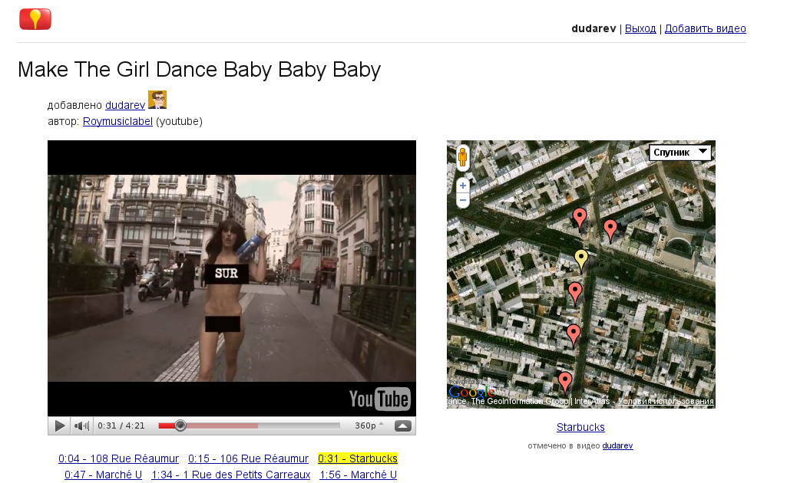

.. |--| unicode:: U+2013   .. en dash
.. |---| unicode:: U+2014  .. em dash

`GeoTree <http://code.google.com/p/geotiles/>`__ |---| библиотека для гео-данных в Google App Engine
####################################################################################################

.. raw:: pdf

    Spacer 0,10%

.. class:: centered

`Артем Дударев <http://dudarev.com>`__

.. class:: centered

`кофе-и-код <http://cnc.dn.ua>`__, Донецк, ноябрь 2010

Альтернативные подходы
----------------------

    * `geodatastore <http://code.google.com/p/geodatastore/>`__
    * `geomodel <http://code.google.com/p/geomodel/>`__
    * `mutiny <http://code.google.com/p/mutiny/>`__
    * `geobox <http://code.google.com/appengine/articles/geosearch.html>`__
    * `geobox-lite <http://github.com/phughes/geobox>`__

`Locovidi <http://locovidi.appspot.com>`__
-------------------------------------------

.. raw:: pdf

    Spacer 0,10%

→ `Video <http://locovidi.appspot.com/video/yt/IQGhq0IlVok>`__, `Google Maps <http://maps.google.com/maps?ll=48.867152,2.347154&z=17&t=k>`__

Используются
-----------------------

* `Google App Engine <http://code.google.com/appengine/>`__
* `Mercurial <http://mercurial.selenic.com/>`__
* hg gvimdiff |---| diff при помощи gvim DirDiff: [`1 <http://hgbook.red-bean.com/read/adding-functionality-with-extensions.html>`__], [`2 <http://www.vim.org/scripts/script.php?script_id=102>`__]

Demo 1
-----------------------

Bulkloader |---| загрузить 200 самых населенных городов
    
Demo 1
-----------------------

.. class:: red

**README** |---| **наш друг**

.. code-block:: bash

    hg clone http://geotiles.googlecode.com/hg/ geotiles 
    cd geotiles/
    hg serve

`http://localhost:8000 <http://localhost:8000>`__

все остальные начинаем в ``geotiles/``

Demo 1 (продолжение)
-----------------------

.. code-block:: bash

    hg checkout 0.1
    cd demo
    dev_appserver.py src

`http://localhost:8080 <http://localhost:8080>`__

.. code-block:: bash

    cd utils
    wget http://download.geonames.org/export/dump/cities15000.zip
    unzip cities15000.zip 
    ./select_cities.py 
    ./load_cities.sh 
    ./update_geo_tree.py 

`http://localhost:8080 <http://localhost:8080>`__

Demo 2
-----------------------

Добавлять и удалять точки вручную

Demo 2
---------------------

.. code-block:: bash

    hg checkout 0.2
    cd demos/
    cd add_remove/
    dev_appserver.py  src/

`http://localhost:8080 <http://localhost:8080>`__

.. code-block:: bash

    hg gvimdiff -r0 -r12

Demo 3
-----------------------

Два дерева

Demo 3
----------------------

.. code-block:: bash

    hg checkout 0.3
    cd demos/cities_and_points/
    dev_appserver.py  src/

.. code-block:: bash

    cd demos/cities_and_points/utils
    ./load_cities.sh 
    ./update_geo_tree.py 

`http://localhost:8080 <http://localhost:8080>`__

.. code-block:: bash

    hg gvimdiff -r12 -r32

Demo 4
--------------------

Taskqueue |---| обновлять на фоне точками из OpenStreetMap

Demo 4
--------------------

.. code-block:: bash

    hg checkout 0.4
    cd demos/load_osm/
    dev_appserver.py src/

`http://localhost:8080 <http://localhost:8080>`__

.. code-block:: bash

    hg gvimdiff -r32 -r36

Еще ссылки
--------------------

* `rst2pdf <http://code.google.com/p/rst2pdf/>`__
* `пост в блоге <http://lateral.netmanagers.com.ar/stories/BBS52.html>`__ о презентациях при помощи rst2pdf 
* частично использовался `стиль <http://blog.notmyidea.org/use-restructured-text-rest-to-power-your-presentations.html>`__ от Alexis Métaireau

.. raw:: pdf

    Spacer 0,20%

* `ссылка на github <http://github.com/dudarev/cncdnua_20101120_python_geotree>`__
